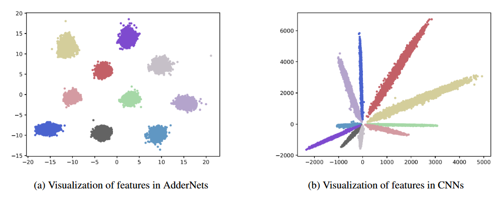

# AdderNet: Do We Really Need Multiplications in Deep Learning?
This code is an inference demo of CVPR 2020 paper [AdderNet: Do We Really Need Multiplications in Deep Learning?](https://arxiv.org/pdf/1912.13200.pdf) 

We present adder networks (AdderNets) to trade massive multiplications in deep neural networks, especially convolutional neural networks (CNNs), for much cheaper additions to reduce computation costs. In AdderNets, we take the L1-norm distance between filters and input feature as the output response. As a result, the proposed AdderNets can achieve 74.9% Top-1 accuracy 91.7% Top-5 accuracy using ResNet-50 on the ImageNet dataset without any multiplication in convolution layer.

## Requirements
- python 3
- pytorch >= 1.1.0
- torchvision

### Preparation
You can follow [pytorch/examples](https://github.com/pytorch/examples/tree/master/imagenet) to prepare the ImageNet data.

The pretrained models are available in [google drive](https://drive.google.com/drive/folders/11ZdIst5Vwqx9Y5zHhirfaI94_7RhcBZH?usp=sharing) or [baidu cloud](https://pan.baidu.com/s/1pkaWhhKVoWPv-MCUjvxzCw) (access code:126b)

### Usage
Run `python test.py --data_dir 'path/to/imagenet_root/'` to evaluate on ImageNet `val` set. You will achieve 74.9% Top accuracy and 91.7% Top-5 accuracy on the ImageNet dataset using ResNet-50.

Run `python test.py --dataset cifar10 --model_dir models/ResNet20-AdderNet.pth --data_dir 'path/to/cifar10_root/'` to evaluate on CIFAR-10. You will achieve 91.8% accuracy on the CIFAR-10 dataset using ResNet-20.

The inference of AdderNets is slow since the adder filters is implemented by `torch.cdist`. You can write [cuda](https://docs.nvidia.com/cuda/cuda-samples/index.html) to achieve higher inference speed. 

## Citation
	@article{AdderNet,
		title={AdderNet: Do We Really Need Multiplications in Deep Learning?},
		author={Chen, Hanting and Wang, Yunhe and Xu, Chunjing and Shi, Boxin and Xu, Chao and Tian, Qi and Xu, Chang},
		journal={CVPR},
		year={2020}
	}

### Contributing
We appreciate all contributions. If you are planning to contribute back bug-fixes, please do so without any further discussion.

If you plan to contribute new features, utility functions or extensions to the core, please first open an issue and discuss the feature with us. Sending a PR without discussion might end up resulting in a rejected PR, because we might be taking the core in a different direction than you might be aware of.
